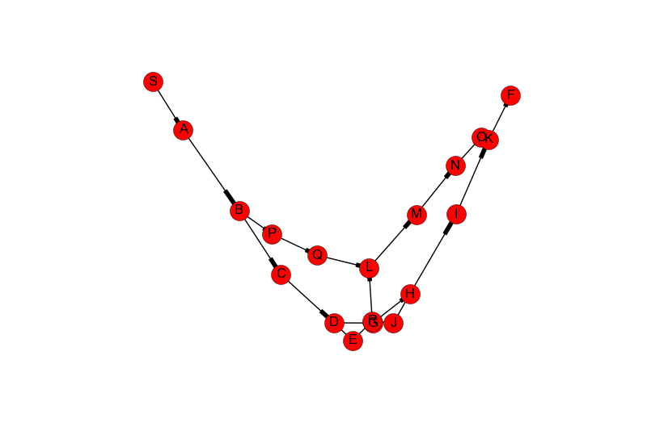

# Homework 3

*THIS IS IN PYTHON 3!! [Examine its github page for installation
instructions](https://github.com/willzfarmer/CSCI3202)*

We are given a text file to generate a graph which looks like the following.

```
./Assignment3.txt
---
[S,A,5]
[S,B,1]
[S,C,4]
[B,E,9]
[B,F,6]
[A,D,2]
[C,G,4]
[D,H,7]
[E,I,6]
[F,J,3]
[F,K,4]
[G,L,5]
[G,M,8]
[G,F,5]
[J,E,4]
[H,F,2]
[I,F,2]
[J,F,3]
[K,F,4]
[L,F,7]
[M,F,2]

A=5
B=6
C=4
D=1
E=7
F=9
G=6
H=5
I=4
J=3
K=2
L=1
M=3
```

Which is defining the nodes, edge weights, and heuristic for `A*` search of a
directed graph. This graph can be represented graphically as well using
[`networkx`](https://networkx.github.io).



We want to apply both [Dijkstra's
Algorithm](https://en.wikipedia.org/wiki/Dijkstra%27s_algorithm) as well as
[A* search](https://en.wikipedia.org/wiki/A*_search_algorithm) to find the
optimal shortest path through this graph from `S` to `F`.

Note, for both algorithms we're using a binary heap for efficiency.

## Dijkstra's Algorithm

We first implement dijkstra's algorithm.

```python
def shortest_path_dijkstra(self, s, e):
    q = self.q                                                        # setup queue
    distances = {name: self.inf for name in self.nodes}               # set distances
    previous = {name: None for name in self.nodes}                    # Establish previous: [None, ...]
    distances[s] = 0                                                  # Set source distance as zero
    [q.push((k, v)) for k, v in distances.items()]                    # add everything to minheap
    num_evaluated = 0
    while len(q.queue) > 0:                                           # while we have things to look for
        u = q.find_min()[0]                                           # find the smallest weight so far
        if u is None or u == e:                                       # if one doesn't exist, or we're at the end, we're done
            break
        qc = [x[0] for x in q.queue]                                  # everything in queue
        for v in self.graph[u].neighbors:                             # examine neighbors of u
            if v in qc:                                               # if we haven't looked at this neighbor yet
                num_evaluated += 1
                alt = distances[u] + self.graph[u].get_edge_weight(v) # what's its distance?
                if alt < distances[v]:                                # if this distance is smaller than encountered so far
                    distances[v] = alt                                # set to current
                    previous[v] = u
                    q.adjust(v, alt)                                  # adjust minheap
    # Reconstruct shortest path
    if not any([v for k, v in previous.items()]):
        r = []
    else:
        r = []
        ne = e
        while True:
            r.insert(0, ne)
            if previous[ne] is None:
                break
            ne = previous[ne]

    if len(r) == 1 and r[len(r) - 1] != s:
        return [], distances[e], previous, distances
    return r, distances[e], previous, distances, num_evaluated
```

## A* Search

We then implement A*.

```python
def shortest_path_Astar(self, s, e):
    q = self.q                                                        # setup queue
    distances = {name: self.inf for name in self.nodes}               # set distances
    previous = {name: None for name in self.nodes}                    # Establish previous: [None, ...]
    distances[s] = 0                                                  # Set source distance as zero
    heuristic = {name: self.inf for name in self.nodes}
    heuristic[s] = 0
    [q.push((k, v)) for k, v in heuristic.items()]                    # add everything to minheap by heuristic
    num_evaluated = 0
    while len(q.queue) > 0:                                           # while we have things to look for
        u = q.find_min()[0]                                           # find the smallest weight so far
        if u is None or u == e:                                       # if one doesn't exist, or we're at the end, we're done
            break
        qc = [x[0] for x in q.queue]                                  # everything in queue
        for v in self.graph[u].neighbors:                             # examine neighbors of u
            if v in qc:                                               # if we haven't looked at this neighbor yet
                num_evaluated += 1
                alt = distances[u] + self.graph[u].get_edge_weight(v) # what's its distance?
                if alt < distances[v]:                                # if this distance is smaller than encountered so far
                    distances[v] = alt                                # set to current
                    previous[v] = u
                    q.adjust(v, distances[v] + (heuristic[e] - heuristic[v]))                                  # adjust minheap
    # Reconstruct shortest path
    if not any([v for k, v in previous.items()]):
        r = []
    else:
        r = []
        ne = e
        while True:
            r.insert(0, ne)
            if previous[ne] is None:
                break
            ne = previous[ne]

    if len(r) == 1 and r[len(r) - 1] != s:
        return [], distances[e], previous, distances
    return r, distances[e], previous, distances, num_evaluated
```

## Analysis

We note that between Dijkstra and A star, A star was more efficient!

```
Dijkstra Algorithm
Path: ['S', 'B', 'F']
with weight: 7.0
7 nodes evaluated
A* Search
Path: ['S', 'B', 'F']
with weight: 7.0
9 nodes evaluated
```
