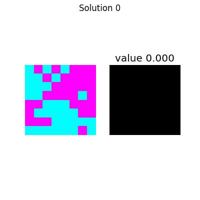
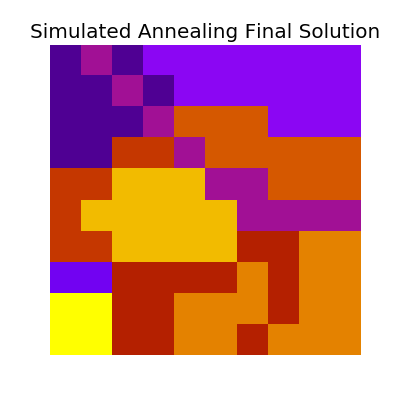
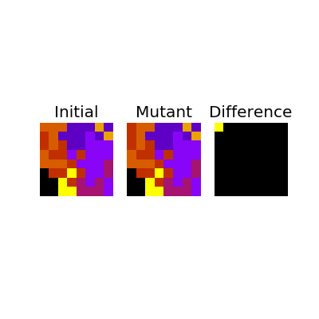
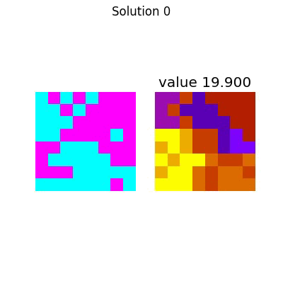
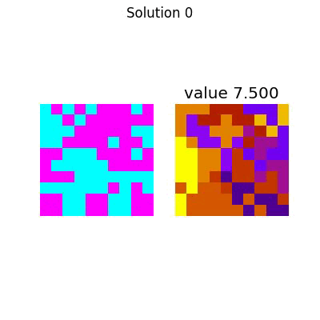
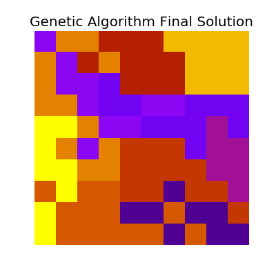

Title: Solving Political Boundaries Through Simulation
Date: 2016-10-14
Category: Homework
tags: homework, ai, python, numerics
Author: Will Farmer
Summary: How to generate solutions of hard problems with simulations.

# An Introduction to Simulated Annealing and Genetic Algorithms

[Simulated Annealing](https://en.wikipedia.org/wiki/Simulated_annealing) and
[Genetic Algorithms](https://en.wikipedia.org/wiki/Genetic_algorithm) are both
methods of finding solutions to problems through simulations. In a nutshell,
basically testing a large amount of semi-random solutions, looking at random
combinations of our solutions, and then keeping the best that we encounter.

The benefit of these algorithms is that we can relatively quickly approximate a
good solution without much computation time. Our solution won't be "the best"
unless we get extraordinarily lucky, however it will be a good approximation.

## What is a "Fitness Function"?

Let's look at what [the wikipedia
page](https://en.wikipedia.org/wiki/Fitness_function) says on the matter.

> A fitness function is a particular type of objective function that is used to
> summarise, as a single figure of merit, how close a given design solution is
> to achieving the set aims.

So in a nutshell, it's a single number that basically tells us how "good" of a
solution we have. For our genetic algorithm and simulated annealing approach
we'll want to maximize this number, thereby maximizing how "good" our solutions
are.

## What is Simulated Annealing?

In a nutshell, simulated annealing can be defined as follows.

1. Generate a random solution
2. Generate a "neighboring solution" to our generated solution
3. Keep whichever is better, or (with decaying probability) take the new one
   regardless
4. Go back to 2

Incomplete python code for this is below.

```python
def simulated_annealing(g):
    s, c = generate_solution(g)
    T = 1
    Tmin = 1e-9
    alpha = 0.99
    k = 1
    i = 0
    while T > Tmin:
        sp, cp = generate_solution_neighbor(g, s, c)
        DE = cp - c
        if DE < 0:
            s = sp
            c = cp
        elif random.random() < math.exp(-DE / (k * T)):
            s = sp
            c = cp
        T *= alpha
        i += 1
    print(s, c, i)
```

## What are Genetic Algorithms?

Genetic algorithms are very similar, and the algorithm can be defined as
follows.

1. Randomly generate an initial population of solutions
2. Use our solution population to generate some large number of children (note,
   these children should inherit properties from their parents)
3. Keep the best of our total population
4. Go back to 2

Again, incomplete code is below.

```python
for i in range(10):
    print('Starting with {}'.format(str(get_value(solutions))))
    new_solutions = gen_new(solutions)
    print('Birthed {}'.format(str(get_value(new_solutions))))
    full_solutions = solutions + new_solutions
    solutions = get_top3(full_solutions)
    print('Evolved to {}'.format(str(get_value(solutions))))
    print('---')
```

# Drawing Political District Boundaries

Now that we know what these monsters are, we can dig into how they can be
applied to solving a system.

Let's say we're interested in determining how to section off a two-party system
of voters into "equal" districts, for some definition of equal. Our system is
defined in a provided file that simply denotes, for every index, the type of
voter in that location. It looks like this

```
D R D R D R R R
D D R D R R R R
D D D R R R R R
D D R R R R D R
R R D D D R R R
R D D D D D R R
R R R D D D D D
D D D D D D R D
```

Which can be plotted for readability.


And our other (larger) state looks like the following.


This pattern will continue for the rest of the writeup, I'll talk about (and
show) the smaller version first, and then follow up with the larger version.

## Procedure

So in the context of our problem, we can examine how the code actually works.

### Overall Structure

* `main` is responsible for running and calling everything
* `genetic_algorithm` uses a genetic approach to solve the problem
* `simulated_annealing` likewise uses simulated annealing
* Each solution uses a `System` instance which keeps track of the system state
* Each solution is an instance of a `Solution` which also keeps track of its
  particular state
* Each district is a `Mask` which provides an ease of access through
  abstraction.

```python
 +main : function

 +genetic_algorithm : function

 +simulated_annealing : function

▼ Mask : class
  ▼+is_valid : function
     +unlabelled : function
   +location : function
   +overlap : function
   +parse_list : function
   +size : function

▼ Solution : class
   +combine : function
   +copy : function
   +fill : function
   +generate_random_solution : function
   +get_district_neighbors : function
   +get_filtered_district_neighbors : function
   +get_full_openspots : function
   +get_neighbors : function
   +get_openspots : function
   +get_solution : function
   +is_valid : function
   +majority : function
   +mutate : function
   +show : function
   +summary : function
   +value : function

▼ System : class
   +empty_state : function
   +height : function
   +stats : function
   +width : function
```

### Helpful Code

### Generating Random Solutions

```python
class Solution(object):

...

    def fill(self, keep_history=False):
        districts = list(range(1, self.numdistricts + 1))
        history = []
        while (self.full_mask == 0).any():
            i = districts[random.randint(0, len(districts) - 1)]
            neighbors = self.get_filtered_district_neighbors(i, [0])
            if len(neighbors) == 0:
                districts.remove(i)
            else:
                y, x = neighbors[random.randint(0, len(neighbors) - 1)]
                self.full_mask[y, x] = i
                if keep_history:
                    history.append(self.copy())
        return history

    def generate_random_solution(self, history=False):
        """
        Solutions are not guaranteed to be equal in size, as if one gets boxed
        off it will stay small...
        """
        solution_history = [self.copy()]
        for i in range(1, self.numdistricts + 1):
            y, x = self.get_openspots(0)
            self.full_mask[y, x] = i
            if history:
                solution_history.append(self.copy())
        solution_history += self.fill(keep_history=history)
        if history:
            return solution_history

...
```




### Simulated Annealing

```python
def simulated_annealing(system, numdistricts, precision, animate, makegif):
    solution = Solution(system, numdistricts)
    solution.generate_random_solution()
    history = [solution]
    k = 0.8
    Tvals = np.arange(1, 1e-12, -1.0/precision)
    for i, T in tqdm(enumerate(Tvals), total=len(Tvals)):
        new_solution = solution.copy()
        new_solution.mutate()
        dv = new_solution.value - solution.value
        if (dv > 0 or random.random() < math.exp(dv / (k * T))):
            solution = new_solution
            history.append(new_solution)

    solution.count = len(Tvals)
    solution.algo = 'Simulated Annealing'
    print(solution)
    print(solution.summary())

    if animate:
        animate_history(system.filename, system.matrix,
                        history, solution.numdistricts,
                        makegif)
```

The entire process looks like this:


Which has the following final solution.


And for the large system,


Which has the following final solution.



#### Mutations

```python
class Solution(object):

...

    def mutate(self):
        i = np.random.randint(1, self.numdistricts)
        y, x = self.get_openspots(i)
        if y is None:
            raise IndexError('No open spots? Something is real bad')
        traversed = set()
        q = queue.Queue()
        q.put((y, x))
        while not q.empty():
            y, x = q.get()
            traversed.add((y, x))

            if (self.full_mask[y, x] != i and
                    self[self.full_mask[y, x]].size > 1):
                self.full_mask[y, x] = i
                break

            neighbors = [_ for _ in self.get_neighbors(y, x)
                         if _ not in traversed]
            for ii, jj in neighbors:
                q.put((ii, jj))

...
```



### Genetic Algorithm

```python
def genetic_algorithm(system, numdistricts, precision, animate, makegif):
    solutions = [Solution(system, numdistricts) for _ in range(3)]
    for s in solutions:
        s.generate_random_solution()
    top_history = []
    for i in tqdm(range(precision)):
        new_solutions = []
        for _ in range(10):
            s1, s2 = np.random.choice(solutions, size=2)
            new_solutions.append(s1.combine(s2))
        full_solutions = new_solutions + solutions
        solutions = [_[0] for _ in
                    sorted([(s, s.value) for s in full_solutions],
                           key=lambda tup: -tup[1])[:3]]
        top_history.append(solutions[0])

    solution = solutions[0]
    solution.count = precision
    solution.algo = 'Genetic Algorithm'
    print(solution)
    print(solution.summary())

    if animate:
        animate_history(system.filename, system.matrix,
                        top_history, solution.numdistricts,
                        makegif)
```

The entire process looks like this:



Which has the following final solution.


And for the large system,



Which has the following final solution.



#### Combining Solutions

```python
class Solution(object):

...

    def combine(self, other_solution):
        new_solution = Solution(self.system, self.numdistricts)

        pick_order = [self, other_solution]
        random.shuffle(pick_order)
        cursor = 0
        for i in range(1, self.numdistricts + 1):
            parent_locations = pick_order[cursor][i].location
            open_locations = new_solution.get_full_openspots(0)
            combined = [(y, x) for y, x in parent_locations
                        if [y, x] in open_locations]
            for y, x in combined:
                new_solution.full_mask[y, x] = i
            cursor ^= 1
        for i in range(1, self.numdistricts + 1):
            y, x = new_solution.get_openspots(i)
            if y is None:
                y, x = new_solution.get_openspots(0)
                new_solution.full_mask[y, x] = i
        new_solution.fill()
        if random.random() < 0.1:
            new_solution.mutate()
        return new_solution
```


### Fitness Function

```python
class Solution(object):

...

    @property
    def value(self):
        """
        This is our fitness function.

        We're trying to maximize similarity in districts, as well as make sure
        that the size of each district is at least 1.
        """
        value = 0
        if not self.is_valid:
            return value
        for i in range(1, self.numdistricts + 1):
            values = self.system.matrix[self[i].mask.astype(bool)]
            if len(values) == 0:
                value = 0
                return value
            else:
                subvalue = np.abs(len(values[values == 0]) - len(values[values == 1]))
                if subvalue < len(values):
                    subvalue += (len(values) - subvalue) * 0.1
                value += subvalue
        return value

...
```
